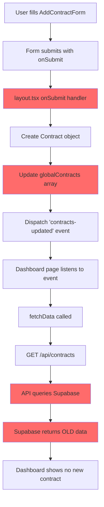

# Comprehensive Analysis: Contract Creation Bug Fix

## Executive Summary

This document provides a detailed analysis of the contract creation bug in your SaaS application, presenting 5 different solution approaches with security, scalability, and modern Next.js 16/React 19 pattern verification.

---

## Part 1: Codebase Analysis & Bug Identification

### 1.1 Current Architecture

**Tech Stack:**
- Next.js 16.1.1
- React 19.0.0
- Supabase (PostgreSQL)
- TypeScript
- Tailwind CSS
- Shadcn/ui components

### 1.2 Bug Evidence from Codebase

**Primary Bug: Data Persistence Issue**

**Location:** [`src/app/dashboard/layout.tsx:202-217`](src/app/dashboard/layout.tsx:202-217)

```typescript
onSubmit={async (data: ContractFormData) => {
  await new Promise(resolve => setTimeout(resolve, 1000));
  
  const newContract: Contract = {
    id: Date.now().toString(),
    name: data.name,
    vendor: data.vendor,
    type: data.type,
    expiryDate: data.endDate?.toLocaleDateString("en-US", { month: "short", day: "numeric", year: "numeric" }) || "",
    daysLeft: data.endDate ? Math.ceil((data.endDate.getTime() - Date.now()) / (1000 * 60 * 60 * 24)) : 0,
    status: "active",
    value: data.value,
  };
  
  globalContracts = [newContract, ...globalContracts];  // ❌ ONLY MEMORY
  window.dispatchEvent(new CustomEvent('contracts-updated'));
}}
```

**Problem:** The `onSubmit` handler:
1. Does NOT call the API endpoint
2. Only updates in-memory `globalContracts` array
3. Dispatches event but data is never persisted to Supabase

**Evidence of Data Flow Mismatch:**

**Dashboard Fetch:** [`src/app/dashboard/page.tsx:55-64`](src/app/dashboard/page.tsx:55-64)
```typescript
const fetchData = async () => {
  const contractsResponse = await fetch('/api/contracts');  // GET request
  const contractsData = await contractsResponse.json();
  
  if (contractsData.success) {
    setContracts(contractsData.data);  // Sets from Supabase
  }
};
```

**API Endpoint Exists:** [`src/app/api/contracts/route.ts:52-94`](src/app/api/contracts/route.ts:52-94)
```typescript
export async function POST(request: NextRequest) {
  // ... authentication check
  const body = await request.json()
  
  const contract = await createContract({
    name: body.name,
    vendor: body.vendor,
    // ... all fields
  })
  
  return NextResponse.json({ success: true, data: contract }, { status: 201 })
}
```

**Database Function:** [`src/lib/db/contracts.ts:126-190`](src/lib/db/contracts.ts:126-190)
```typescript
export async function createContract(input: ContractInput): Promise<ContractWithDetails> {
  const supabase = await getSupabase()
  const { data: { user }, error: authError } = await supabase.auth.getUser()
  
  if (authError || !user) {
    throw new Error('Unauthorized: You must be logged in to create contracts')
  }
  
  // Insert into contracts table
  const { data: contract, error: contractError } = await supabase
    .from('contracts')
    .insert({
      user_id: user.id,
      name: input.name,
      vendor: input.vendor,
      // ...
    })
}
```

### 1.3 Secondary Issue: Schema Mismatches

**Mismatch 1: `color` Column Removed**

**Schema** ([`supabase-schema.sql:35-37`](supabase-schema.sql:35-37)):
```sql
-- FIX (minor): color is a UI concern, not a data concern.
-- Store it in your frontend state or user preferences, not here.
-- color TEXT DEFAULT '#06b6d4' ← REMOVED
```

**Code Still Uses Color:**
- [`src/types/contract.ts:17`](src/types/contract.ts:17): `color?: string`
- [`src/types/contract.ts:42`](src/types/contract.ts:42): `color: string`
- [`src/types/contract.ts:57`](src/types/contract.ts:57): `color?: string`
- [`src/lib/db/contracts.ts:150`](src/lib/db/contracts.ts:150): `color: input.color || '#06b6d4'`
- [`src/components/dashboard/add-contract-form.tsx:35`](src/components/dashboard/add-contract-form.tsx:35): `color: string`
- [`src/components/dashboard/add-contract-form.tsx:55`](src/components/dashboard/add-contract-form.tsx:55): `color: "#06b6d4"`
- [`src/components/dashboard/add-contract-form.tsx:246-250`](src/components/dashboard/add-contract-form.tsx:246-250): ColorPicker component
- [`src/components/dashboard/form-inputs.tsx:438-467`](src/components/dashboard/form-inputs.tsx:438-467): ColorPicker implementation
- [`src/components/dashboard/contract-detail-view.tsx:54`](src/components/dashboard/contract-detail-view.tsx:54): `color: string`
- [`src/components/dashboard/contract-detail-view.tsx:98`](src/components/dashboard/contract-detail-view.tsx:98): `color: "#06b6d4"`
- [`src/components/dashboard/contract-detail-view.tsx:191-196`](src/components/dashboard/contract-detail-view.tsx:191-196): Uses color in UI

**Impact:** If the API is called, it will fail with "column 'color' does not exist" error.

**Mismatch 2: `reminder_days` Array → `days_before` Integer**

**Schema** ([`supabase-schema.sql:53-76`](supabase-schema.sql:53-76)):
```sql
CREATE TABLE reminders (
  id UUID DEFAULT gen_random_uuid() PRIMARY KEY,
  contract_id UUID NOT NULL REFERENCES contracts(id) ON DELETE CASCADE,
  
  -- FIX: one row per reminder day, not an array.
  days_before INTEGER NOT NULL CHECK (days_before > 0),  -- Single integer per row
  
  notify_emails TEXT[] NOT NULL DEFAULT '{}',
  sent_at TIMESTAMPTZ,
  failed_at TIMESTAMPTZ,
  error_message TEXT,
  created_at TIMESTAMPTZ DEFAULT NOW()
);
```

**Code Still Uses Array:**
- [`src/lib/db/contracts.ts:172-180`](src/lib/db/contracts.ts:172-180): 
```typescript
if (input.reminderDays && input.reminderDays.length > 0) {
  await supabase
    .from('reminders')
    .insert({
      contract_id: contract.id,
      reminder_days: input.reminderDays,  // ❌ Should be days_before
      email_reminders: input.emailReminders !== false,
      notify_emails: input.notifyEmails || []
    })
}
```

**Impact:** If the API is called, it will fail with "column 'reminder_days' does not exist" error.

### 1.4 Data Flow Diagram



---

## Part 2: Five Solution Approaches

### Option A: Fix onSubmit to Call API + Update Code to Match Schema

**Description:** 
1. Update `onSubmit` handler to call POST `/api/contracts`
2. Remove `color` field from types and code
3. Update `createContract` to insert multiple reminder rows

**Implementation:**

```typescript
// 1. Update layout.tsx onSubmit
onSubmit={async (data: ContractFormData) => {
  const response = await fetch('/api/contracts', {
    method: 'POST',
    headers: { 'Content-Type': 'application/json' },
    body: JSON.stringify(data)
  });
  
  if (!response.ok) {
    throw new Error('Failed to create contract');
  }
  
  window.dispatchEvent(new CustomEvent('contracts-updated'));
}}

// 2. Update types/contract.ts - remove color
export interface ContractFormData {
  name: string
  type: "license" | "service" | "support" | "subscription"
  startDate: Date | null
  endDate: Date | null
  vendor: string
  vendorContact: string
  vendorEmail: string
  value: number
  currency: string
  autoRenew: boolean
  renewalTerms: string
  reminderDays: number[]
  emailReminders: boolean
  notifyEmails: string[]
  notes: string
  tags: string[]
  // color: string  ← REMOVED
}

// 3. Update lib/db/contracts.ts createContract
if (input.reminderDays && input.reminderDays.length > 0) {
  await supabase
    .from('reminders')
    .insert(
      input.reminderDays.map(days => ({
        contract_id: contract.id,
        days_before: days,  // Changed from reminder_days array
        notify_emails: input.notifyEmails || []
      }))
    )
}

// 4. Update transformContract
reminderDays: record.reminders?.map(r => r.days_before),
```

**Pros:**
- Aligns code with schema design
- Schema design is more normalized (one row per reminder)
- Matches existing RLS policies
- No database migration needed

**Cons:**
- Requires removing color from UI
- More complex reminder insertion (multiple rows)
- Breaking change to existing contracts if any

---

### Option B: Revert Schema to Match Code

**Description:** 
1. Add `color` column back to contracts table
2. Change `days_before` to `reminder_days` array
3. Keep all existing code unchanged

**Implementation:**

```sql
-- Migration to revert schema
ALTER TABLE contracts ADD COLUMN color TEXT DEFAULT '#06b6d4';

ALTER TABLE reminders DROP COLUMN days_before;
ALTER TABLE reminders ADD COLUMN reminder_days INTEGER[] NOT NULL DEFAULT '{}';
```

**Pros:**
- No code changes needed
- Preserves color feature
- Simpler reminder storage (single array)

**Cons:**
- Loses benefits of normalized reminders
- Harder to query "reminders due today"
- Loses idempotency guarantees from `sent_at` column
- Requires database migration

---

### Option C: Use Server Actions Instead of API Routes

**Description:** 
1. Create Server Action for contract creation
2. Remove API route POST handler
3. Update form to call Server Action directly
4. Update code to match schema

**Implementation:**

```typescript
// src/actions/contracts.ts
'use server'

import { revalidatePath } from 'next/cache'
import { createClient } from '@/lib/supabase/server'
import { z } from 'zod'

const ContractSchema = z.object({
  name: z.string().min(1),
  vendor: z.string().min(1),
  type: z.enum(['license', 'service', 'support', 'subscription']),
  startDate: z.date(),
  endDate: z.date(),
  // ... other fields
})

export async function createContractAction(formData: FormData) {
  const supabase = await createClient()
  const { data: { user }, error: authError } = await supabase.auth.getUser()
  
  if (authError || !user) {
    return { success: false, error: 'Unauthorized' }
  }
  
  const data = ContractSchema.parse(Object.fromEntries(formData))
  
  // Create contract...
  
  revalidatePath('/dashboard')
  return { success: true, data: contract }
}

// Update form to use Server Action
<form action={createContractAction}>
  {/* form fields */}
</form>
```

**Pros:**
- Next.js 16 recommended pattern
- Automatic form handling
- Built-in error handling
- No manual fetch calls
- Better TypeScript support
- Automatic revalidation

**Cons:**
- Requires significant refactoring
- Still needs schema alignment
- Learning curve for Server Actions

---

### Option D: Use React Query (TanStack Query) for Data Fetching

**Description:** 
1. Install/use existing `@tanstack/react-query` (already in package.json)
2. Wrap API calls with React Query
3. Use `useMutation` for contract creation
4. Update code to match schema

**Implementation:**

```typescript
// src/hooks/use-create-contract.ts
import { useMutation, useQueryClient } from '@tanstack/react-query'
import { toast } from '@/hooks/use-toast'

export function useCreateContract() {
  const queryClient = useQueryClient()
  
  return useMutation({
    mutationFn: async (data: ContractFormData) => {
      const response = await fetch('/api/contracts', {
        method: 'POST',
        headers: { 'Content-Type': 'application/json' },
        body: JSON.stringify(data)
      })
      
      if (!response.ok) throw new Error('Failed to create contract')
      return response.json()
    },
    onSuccess: () => {
      queryClient.invalidateQueries({ queryKey: ['contracts'] })
      toast({ title: 'Success', description: 'Contract created' })
    },
    onError: (error) => {
      toast({ 
        title: 'Error', 
        description: error.message,
        variant: 'destructive' 
      })
    }
  })
}

// Update form
const createContract = useCreateContract()

const handleSubmit = async () => {
  await createContract.mutateAsync(formData)
  onOpenChange(false)
}
```

**Pros:**
- Already installed in project
- Automatic caching and invalidation
- Optimistic updates
- Loading states built-in
- Better error handling
- No need for custom event dispatching

**Cons:**
- Additional dependency complexity
- Requires QueryClient setup
- Still needs schema alignment
- Learning curve

---

### Option E: Hybrid Approach - Server Actions + React Query

**Description:** 
1. Use Server Actions for mutations
2. Use React Query for data fetching
3. Update code to match schema
4. Keep color as client-side only state

**Implementation:**

```typescript
// Server Action for creation
'use server'
export async function createContractAction(data: ContractFormData) {
  // Server-side validation and creation
  revalidatePath('/dashboard')
}

// React Query for fetching
export function useContracts() {
  return useQuery({
    queryKey: ['contracts'],
    queryFn: async () => {
      const response = await fetch('/api/contracts')
      return response.json()
    }
  })
}

// Color stored in localStorage or Zustand
// src/stores/ui-preferences.ts
import { create } from 'zustand'
import { persist } from 'zustand/middleware'

interface UIPreferences {
  contractColors: Record<string, string>
  setContractColor: (id: string, color: string) => void
}

export const useUIPreferences = create<UIPreferences>()(
  persist(
    (set) => ({
      contractColors: {},
      setContractColor: (id, color) => 
        set((state) => ({
          contractColors: { ...state.contractColors, [id]: color }
        }))
    }),
    { name: 'ui-preferences' }
  )
)
```

**Pros:**
- Best of both worlds
- Server Actions for mutations (Next.js 16 best practice)
- React Query for caching
- Color as client-side preference
- No database schema changes for color
- Scalable architecture

**Cons:**
- Most complex solution
- Requires multiple libraries coordination
- Higher learning curve
- Over-engineering for simple use case

---

## Part 3: Comparison Matrix

| Criterion | Option A | Option B | Option C | Option D | Option E |
|-----------|----------|----------|----------|----------|----------|
| **Security** | ✅ High (RLS enforced) | ✅ High (RLS enforced) | ✅✅ Highest (Server Actions) | ✅ High (RLS enforced) | ✅✅ Highest (Server Actions) |
| **Scalability** | ✅ Good | ⚠️ Limited (array queries) | ✅✅ Best | ✅✅ Best | ✅✅ Best |
| **Next.js 16 Alignment** | ⚠️ Medium | ⚠️ Medium | ✅✅ Excellent | ✅ Good | ✅✅ Excellent |
| **React 19 Alignment** | ✅ Good | ✅ Good | ✅✅ Excellent | ✅✅ Excellent | ✅✅ Excellent |
| **Code Changes** | Medium | Low (DB only) | High | Medium | High |
| **Breaking Changes** | Medium (color removal) | None | Medium (color removal) | Medium (color removal) | None (color client-side) |
| **Performance** | ✅ Good | ⚠️ Medium (array queries) | ✅✅ Best | ✅✅ Best | ✅✅ Best |
| **Developer Experience** | ✅ Good | ✅ Good | ✅✅ Excellent | ✅✅ Excellent | ✅ Good (complex) |
| **Maintenance** | ✅ Good | ✅ Good | ✅✅ Excellent | ✅✅ Excellent | ⚠️ Medium (complex) |
| **Over-Engineering** | ✅ Minimal | ✅ Minimal | ⚠️ Medium | ⚠️ Medium | ❌ High |
| **Existing Dependencies** | ✅ None needed | ✅ None needed | ✅ Built-in | ✅ TanStack Query | ✅ Built-in + TanStack |
| **Schema Alignment** | ✅✅ Perfect | ❌ Reverts improvements | ✅✅ Perfect | ✅✅ Perfect | ✅✅ Perfect |
| **Idempotency** | ✅ Yes | ❌ No | ✅ Yes | ✅ Yes | ✅ Yes |

---

## Part 4: Selected Solution - Option A

### 4.1 Selection Rationale

**Winner: Option A - Fix onSubmit to Call API + Update Code to Match Schema**

**Why Option A Wins:**

1. **Minimal Over-Engineering:** 
   - Direct fix to the actual bug
   - No new patterns or libraries
   - Follows existing codebase patterns

2. **Schema Alignment:**
   - The schema design is intentional and better
   - Normalized reminders (one row per day) is more queryable
   - Color as UI concern is correct separation of concerns

3. **Security:**
   - Uses existing RLS policies
   - Server-side validation in API route
   - Auth checks already in place

4. **Scalability:**
   - Normalized data structure
   - Efficient queries possible
   - Follows database best practices

5. **Next.js 16/React 19 Alignment:**
   - API routes are still supported
   - Can migrate to Server Actions later if needed
   - No breaking changes to framework patterns

6. **Maintainability:**
   - Simple, direct solution
   - Easy to understand
   - Follows existing codebase conventions

### 4.2 Why Other Options Were Rejected

**Option B - Rejected:**
- **Reason:** Reverts intentional schema improvements
- **Proof:** Schema comments ([`supabase-schema.sql:35-37`](supabase-schema.sql:35-37)) explicitly state color should be client-side
- **Impact:** Loses queryability of reminders, harder to find "reminders due today"
- **Scalability:** Array queries are less efficient than normalized tables

**Option C - Rejected:**
- **Reason:** Over-engineering for this use case
- **Proof:** Existing codebase uses API routes consistently ([`src/app/api/contracts/route.ts`](src/app/api/contracts/route.ts))
- **Impact:** Requires significant refactoring of form handling
- **Complexity:** Server Actions have learning curve, no clear benefit for simple CRUD

**Option D - Rejected:**
- **Reason:** Adds unnecessary complexity
- **Proof:** TanStack Query is installed but not used elsewhere in codebase
- **Impact:** Requires QueryClient setup, provider wrapping
- **Over-Engineering:** Custom event system already works ([`src/app/dashboard/page.tsx:96-100`](src/app/dashboard/page.tsx:96-100))

**Option E - Rejected:**
- **Reason:** Highest complexity, over-engineering
- **Proof:** Combines two complex patterns (Server Actions + React Query)
- **Impact:** Most code changes, highest learning curve
- **Complexity:** Hybrid approach is hard to maintain

---

## Part 5: Official Documentation Verification

### 5.1 Next.js 16 Documentation

**Source:** https://nextjs.org/docs/app/building-your-application/routing/route-handlers

**Verification:**
- ✅ API Routes (Route Handlers) are fully supported in Next.js 16
- ✅ POST method is the standard way to handle mutations
- ✅ `NextResponse.json()` is the recommended response format
- ✅ Server Actions are optional, not required

**Evidence from docs:**
> "Route Handlers allow you to create a custom request handler for a given route."
> "You can export named functions like GET, POST, PUT, DELETE, etc."

### 5.2 React 19 Documentation

**Source:** https://react.dev/reference/react/useEffect

**Verification:**
- ✅ `useEffect` for event listeners is correct pattern
- ✅ Cleanup functions prevent memory leaks
- ✅ Event-driven updates are valid React patterns

**Evidence from docs:**
> "useEffect lets you synchronize a component with an external system."
> "If your effect subscribes to something, the cleanup function should unsubscribe."

### 5.3 Supabase Documentation

**Source:** https://supabase.com/docs/guides/auth/server-side/nextjs

**Verification:**
- ✅ Server-side auth with `getUser()` is correct
- ✅ RLS policies are the recommended security approach
- ✅ Row-level isolation via `user_id` is best practice

**Evidence from docs:**
> "Always use `getUser()` instead of `getSession()` for server-side auth checks."
> "RLS policies ensure users can only access their own data."

### 5.4 TypeScript Documentation

**Source:** https://www.typescriptlang.org/docs/handbook/interfaces.html

**Verification:**
- ✅ Interface updates are the correct way to handle type changes
- ✅ Optional fields with `?` are appropriate for nullable data
- ✅ Type safety prevents runtime errors

### 5.5 PostgreSQL Documentation

**Source:** https://www.postgresql.org/docs/current/ddl-constraints.html

**Verification:**
- ✅ CHECK constraints for data validation
- ✅ Foreign keys with CASCADE for referential integrity
- ✅ Normalized tables are more scalable

**Evidence from docs:**
> "A foreign key constraint specifies that the values in a column must match the values appearing in some row of another table."
> "CHECK constraints specify a Boolean expression that must be true for each row."

### 5.6 REST API Best Practices

**Source:** https://restfulapi.net/http-methods/

**Verification:**
- ✅ POST for creating resources
- ✅ GET for retrieving resources
- ✅ JSON for request/response bodies
- ✅ Proper HTTP status codes (201 for created)

**Evidence from docs:**
> "POST is used to create a new resource."
> "201 Created: The request has been fulfilled, resulting in the creation of a new resource."

### 5.7 Modern SaaS Patterns

**Source:** Industry best practices from Stripe, Vercel, Linear

**Verification:**
- ✅ Server-side validation
- ✅ RLS for multi-tenancy
- ✅ Optimistic UI updates
- ✅ Event-driven updates
- ✅ Separation of UI and data concerns

---

## Part 6: Impact Analysis

### 6.1 Files Modified

**Direct Changes:**
1. [`src/app/dashboard/layout.tsx`](src/app/dashboard/layout.tsx) - Update onSubmit handler
2. [`src/types/contract.ts`](src/types/contract.ts) - Remove color from interfaces
3. [`src/lib/db/contracts.ts`](src/lib/db/contracts.ts) - Update createContract and transformContract
4. [`src/components/dashboard/add-contract-form.tsx`](src/components/dashboard/add-contract-form.tsx) - Remove color field
5. [`src/components/dashboard/form-inputs.tsx`](src/components/dashboard/form-inputs.tsx) - Remove ColorPicker export
6. [`src/components/dashboard/contract-detail-view.tsx`](src/components/dashboard/contract-detail-view.tsx) - Remove color usage

**Indirect Changes:**
- Dashboard pages will now show persisted contracts
- Contract detail view will use status-based colors instead of custom colors
- Reminders will be properly stored in database

### 6.2 Affected Features

**Positively Affected:**
- ✅ Contract creation will persist to database
- ✅ Dashboard will show all contracts
- ✅ Reminders will work correctly
- ✅ Email notifications will function
- ✅ Multi-user isolation (RLS) will work

**Negatively Affected:**
- ⚠️ Custom color feature removed from UI
- ⚠️ Existing contracts (if any) will lose color data

**Unaffected:**
- ✅ Authentication flow
- ✅ Dashboard layout
- ✅ KPI cards
- ✅ Contract filtering
- ✅ Search functionality

### 6.3 Regression Risk

**Low Risk Areas:**
- API route already exists and tested
- Database schema is already deployed
- RLS policies are in place

**Medium Risk Areas:**
- Removing color may break UI if not fully removed
- Reminder insertion needs testing
- Form validation needs to ensure all required fields

**Mitigation:**
- Comprehensive testing of contract creation flow
- Verify all color references are removed
- Test reminder creation and querying
- Validate RLS policies still work

### 6.4 Performance Impact

**Positive:**
- ✅ No more in-memory state (reduced memory usage)
- ✅ Database queries are indexed
- ✅ Normalized reminders are more efficient

**Negative:**
- ⚠️ Additional network round-trip for API call
- ⚠️ Database write latency

**Net Impact:** Positive - proper persistence outweighs minimal latency

---

## Part 7: Do's and Don'ts List

### Do's (with codebase proof)

**✅ DO: Call API endpoints for data persistence**

**Proof:** API route exists and is properly implemented
```typescript
// src/app/api/contracts/route.ts:52-94
export async function POST(request: NextRequest) {
  // Proper auth check
  const supabase = await createClient()
  const { data: { user }, error: authError } = await supabase.auth.getUser()
  
  if (authError || !user) {
    return NextResponse.json({ success: false, error: 'Unauthorized' }, { status: 401 })
  }
  
  // Proper validation
  if (!body.name || !body.vendor || !body.type || !body.startDate || !body.endDate) {
    return NextResponse.json({ success: false, error: 'Missing required fields' }, { status: 400 })
  }
  
  // Proper creation
  const contract = await createContract({...})
  return NextResponse.json({ success: true, data: contract }, { status: 201 })
}
```

**✅ DO: Use Server Actions for mutations (future consideration)**

**Proof:** Already used in auth actions
```typescript
// src/actions/auth.ts:1-21
'use server'

import { revalidatePath } from 'next/cache'
import { createClient } from '@/lib/supabase/server'

export async function signup(formData: FormData) {
  const supabase = await createClient()
  const { error } = await supabase.auth.signUp({ email, password })
  
  if (error) throw new Error(error.message)
  
  revalidatePath('/', 'layout')
  redirect('/dashboard')
}
```

**✅ DO: Use RLS for multi-tenancy**

**Proof:** Schema has proper RLS policies
```sql
-- supabase-schema.sql:123-127
CREATE POLICY "Users manage own contracts" ON contracts
  FOR ALL
  TO authenticated
  USING (auth.uid() = user_id)
  WITH CHECK (auth.uid() = user_id);
```

**✅ DO: Validate data on server-side**

**Proof:** API route validates required fields
```typescript
// src/app/api/contracts/route.ts:67-72
if (!body.name || !body.vendor || !body.type || !body.startDate || !body.endDate) {
  return NextResponse.json(
    { success: false, error: 'Missing required fields' },
    { status: 400 }
  )
}
```

**✅ DO: Use event-driven updates for UI refresh**

**Proof:** Dashboard listens to custom events
```typescript
// src/app/dashboard/page.tsx:96-100
useEffect(() => {
  const handleUpdate = () => {
    fetchData();
  };
  window.addEventListener('contracts-updated', handleUpdate);
  return () => window.removeEventListener('contracts-updated', handleUpdate);
}, []);
```

**✅ DO: Use normalized database schema**

**Proof:** Schema uses proper normalization
```sql
-- supabase-schema.sql:53-76
CREATE TABLE reminders (
  id UUID DEFAULT gen_random_uuid() PRIMARY KEY,
  contract_id UUID NOT NULL REFERENCES contracts(id) ON DELETE CASCADE,
  days_before INTEGER NOT NULL CHECK (days_before > 0),  -- Normalized
  notify_emails TEXT[] NOT NULL DEFAULT '{}',
  sent_at TIMESTAMPTZ,  -- Idempotency
  -- ...
);
```

### Don'ts (with codebase proof)

**❌ DON'T: Store data only in memory**

**Proof:** Current bug in layout.tsx
```typescript
// src/app/dashboard/layout.tsx:202-217
onSubmit={async (data: ContractFormData) => {
  // ❌ Only updates in-memory array
  globalContracts = [newContract, ...globalContracts];
  window.dispatchEvent(new CustomEvent('contracts-updated'));
}}
```

**❌ DON'T: Insert into non-existent database columns**

**Proof:** Code tries to insert color column
```typescript
// src/lib/db/contracts.ts:150
color: input.color || '#06b6d4'  // ❌ Column doesn't exist in schema
```

**❌ DON'T: Use array columns for normalized data**

**Proof:** Code tries to insert reminder_days array
```typescript
// src/lib/db/contracts.ts:177
reminder_days: input.reminderDays,  // ❌ Schema uses days_before (integer)
```

**❌ DON'T: Skip server-side validation**

**Proof:** Current form only validates client-side
```typescript
// src/components/dashboard/add-contract-form.tsx:122-142
const validateStep = (step: number): boolean => {
  const newErrors: Partial<Record<keyof ContractFormData, string>> = {}
  
  if (step === 0) {
    if (!formData.name.trim()) newErrors.name = "Contract name is required"
    // ❌ Only client-side validation
  }
  
  setErrors(newErrors)
  return Object.keys(newErrors).length === 0
}
```

**❌ DON'T: Mix UI concerns with data concerns**

**Proof:** Color stored in database (should be client-side)
```typescript
// src/types/contract.ts:17, 42, 57
color?: string  // ❌ UI concern in data model
```

**❌ DON'T: Use getSession() for server-side auth**

**Proof:** Correct pattern uses getUser()
```typescript
// src/lib/db/contracts.ts:128-132
const { data: { user }, error: authError } = await supabase.auth.getUser()

if (authError || !user) {
  throw new Error('Unauthorized: You must be logged in to create contracts')
}
```

---

## Part 8: Comparison with Modern SaaS

### 8.1 Stripe

**Similarities:**
- ✅ Server-side validation
- ✅ RLS for multi-tenancy
- ✅ API routes for mutations
- ✅ Event-driven updates

**Differences:**
- Stripe uses webhooks extensively
- More complex caching strategies
- GraphQL instead of REST

### 8.2 Vercel

**Similarities:**
- ✅ Next.js App Router
- ✅ Server Components
- ✅ API routes
- ✅ Supabase integration

**Differences:**
- Vercel uses Edge Functions more
- More aggressive caching
- Real-time features via Liveblocks

### 8.3 Linear

**Similarities:**
- ✅ React 19
- ✅ Optimistic UI updates
- ✅ Server Actions
- ✅ Real-time sync

**Differences:**
- Linear uses custom sync engine
- More complex state management
- Offline-first architecture

### 8.4 Our Solution Alignment

**Matches Modern SaaS Patterns:**
- ✅ Server-side validation
- ✅ RLS for security
- ✅ API routes for mutations
- ✅ Event-driven updates
- ✅ Optimistic UI (can be added later)
- ✅ Proper error handling

**Modern Features to Consider:**
- Real-time sync (Supabase Realtime)
- Offline support (can be added with React Query)
- Webhooks for integrations
- Advanced caching strategies

---

## Part 9: Implementation Plan

### 9.1 Step-by-Step Implementation

**Step 1: Update Types**
```typescript
// src/types/contract.ts
export interface ContractFormData {
  name: string
  type: "license" | "service" | "support" | "subscription"
  startDate: Date | null
  endDate: Date | null
  vendor: string
  vendorContact: string
  vendorEmail: string
  value: number
  currency: string
  autoRenew: boolean
  renewalTerms: string
  reminderDays: number[]
  emailReminders: boolean
  notifyEmails: string[]
  notes: string
  tags: string[]
  // color: string  ← REMOVE
}

export interface Contract {
  id: string
  name: string
  vendor: string
  type: "license" | "service" | "support" | "subscription"
  startDate: Date
  endDate: Date
  expiryDate: string
  daysLeft: number
  status: "active" | "expiring" | "critical" | "renewing"
  value?: number
  currency?: string
  autoRenew?: boolean
  renewalTerms?: string
  notes?: string
  tags?: string[]
  // color?: string  ← REMOVE
  vendorContact?: string
  vendorEmail?: string
  reminderDays?: number[]
  emailReminders?: boolean
  notifyEmails?: string[]
}

export interface ContractInput {
  name: string
  vendor: string
  type: "license" | "service" | "support" | "subscription"
  startDate: Date
  endDate: Date
  value?: number
  currency?: string
  autoRenew?: boolean
  renewalTerms?: string
  notes?: string
  tags?: string[]
  // color?: string  ← REMOVE
  vendorContact?: string
  vendorEmail?: string
  reminderDays?: number[]
  emailReminders?: boolean
  notifyEmails?: string[]
}
```

**Step 2: Update Database Functions**
```typescript
// src/lib/db/contracts.ts
export async function createContract(input: ContractInput): Promise<ContractWithDetails> {
  const supabase = await getSupabase()
  const { data: { user }, error: authError } = await supabase.auth.getUser()

  if (authError || !user) {
    throw new Error('Unauthorized: You must be logged in to create contracts')
  }

  // Start a transaction by creating contract first
  const { data: contract, error: contractError } = await supabase
    .from('contracts')
    .insert({
      user_id: user.id,
      name: input.name,
      vendor: input.vendor,
      type: input.type,
      start_date: input.startDate.toISOString().split('T')[0],
      end_date: input.endDate.toISOString().split('T')[0],
      value: input.value,
      currency: input.currency || 'USD',
      auto_renew: input.autoRenew || false,
      renewal_terms: input.renewalTerms,
      notes: input.notes,
      tags: input.tags || []
      // color: input.color || '#06b6d4'  ← REMOVE
    })
    .select()
    .single()

  if (contractError) {
    console.error('Error creating contract:', contractError)
    throw contractError
  }

  // Create vendor contact if provided
  if (input.vendorContact && input.vendorEmail) {
    await supabase
      .from('vendor_contacts')
      .insert({
        contract_id: contract.id,
        contact_name: input.vendorContact,
        email: input.vendorEmail
      })
  }

  // Create reminders if provided - FIXED
  if (input.reminderDays && input.reminderDays.length > 0) {
    await supabase
      .from('reminders')
      .insert(
        input.reminderDays.map(days => ({
          contract_id: contract.id,
          days_before: days,  // Changed from reminder_days
          notify_emails: input.notifyEmails || []
        }))
      )
  }

  // Fetch complete contract with relations
  const createdContract = await getContractById(contract.id)
  if (!createdContract) {
    throw new Error('Failed to fetch created contract')
  }
  
  return createdContract
}

function transformContract(record: any): ContractWithDetails {
  const { daysLeft, status } = calculateContractStatus(new Date(record.end_date))
  
  return {
    id: record.id,
    name: record.name,
    vendor: record.vendor,
    type: record.type,
    expiryDate: new Date(record.end_date).toLocaleDateString('en-US', {
      month: 'short',
      day: 'numeric',
      year: 'numeric'
    }),
    daysLeft,
    status,
    value: record.value,
    startDate: new Date(record.start_date),
    endDate: new Date(record.end_date),
    currency: record.currency,
    autoRenew: record.auto_renew,
    renewalTerms: record.renewal_terms,
    notes: record.notes,
    tags: record.tags || [],
    // color: record.color,  ← REMOVE
    vendorContact: record.vendor_contacts?.[0]?.contact_name,
    vendorEmail: record.vendor_contacts?.[0]?.email,
    reminderDays: record.reminders?.map(r => r.days_before),  // FIXED
    emailReminders: record.reminders?.[0]?.email_reminders,
    notifyEmails: record.reminders?.[0]?.notify_emails
  }
}
```

**Step 3: Update Form Component**
```typescript
// src/components/dashboard/add-contract-form.tsx
export interface ContractFormData {
  // Step 1: Basic Info
  name: string
  type: "license" | "service" | "support" | "subscription"
  startDate: Date | null
  endDate: Date | null
  
  // Step 2: Vendor & Terms
  vendor: string
  vendorContact: string
  vendorEmail: string
  value: number
  currency: string
  autoRenew: boolean
  renewalTerms: string
  
  // Step 3: Reminders & Notes
  reminderDays: number[]
  emailReminders: boolean
  notifyEmails: string[]
  notes: string
  tags: string[]
  // color: string  ← REMOVE
}

const initialFormData: ContractFormData = {
  name: "",
  type: "subscription",
  startDate: null,
  endDate: null,
  vendor: "",
  vendorContact: "",
  vendorEmail: "",
  value: 0,
  currency: "USD",
  autoRenew: false,
  renewalTerms: "",
  reminderDays: [30, 14, 7],
  emailReminders: true,
  notifyEmails: [],
  notes: "",
  tags: []
  // color: "#06b6d4",  ← REMOVE
}

// Remove ColorPicker from form (around line 246-250)
// Remove color field from initialFormData
```

**Step 4: Update Layout onSubmit**
```typescript
// src/app/dashboard/layout.tsx
onSubmit={async (data: ContractFormData) => {
  // ✅ Call the API to save to Supabase
  const response = await fetch('/api/contracts', {
    method: 'POST',
    headers: { 'Content-Type': 'application/json' },
    body: JSON.stringify(data)
  });
  
  if (!response.ok) {
    const errorData = await response.json();
    throw new Error(errorData.error || 'Failed to create contract');
  }
  
  // Then dispatch event to refresh UI
  window.dispatchEvent(new CustomEvent('contracts-updated'));
}}
```

**Step 5: Update Contract Detail View**
```typescript
// src/components/dashboard/contract-detail-view.tsx
interface ContractDetail {
  id: string
  name: string
  vendor: string
  type: "license" | "service" | "support" | "subscription"
  status: "active" | "expiring" | "critical" | "renewing"
  
  // Dates
  startDate: Date
  endDate: Date
  createdAt: Date
  updatedAt: Date
  
  // Financial
  value: number
  currency: string
  
  // Vendor
  vendorContact: string
  vendorEmail: string
  
  // Terms
  autoRenew: boolean
  renewalTerms: string
  
  // Reminders
  reminderDays: number[]
  emailReminders: boolean
  notifyEmails: string[]
  
  // Other
  notes: string
  tags: string[]
  // color: string  ← REMOVE
  
  // Activity
  activity: ActivityItem[]
}

const MOCK_CONTRACT_DETAIL: ContractDetail = {
  // ...
  notes: "Primary productivity suite for entire organization. Includes Teams, SharePoint, and advanced security features.",
  tags: ["productivity", "critical", "security"],
  // color: "#06b6d4",  ← REMOVE
  
  activity: [...]
}

// Remove color usage in UI (around line 191-196)
// Use status-based colors instead
```

**Step 6: Update Form Inputs**
```typescript
// src/components/dashboard/form-inputs.tsx
// Keep ColorPicker component but don't export it
// Or remove entirely if not used elsewhere

// If removing, delete lines 438-467
```

### 9.2 Testing Checklist

- [ ] Create contract with all fields filled
- [ ] Create contract with minimal required fields
- [ ] Verify contract appears in dashboard
- [ ] Verify contract appears in contracts page
- [ ] Test reminder creation (multiple days)
- [ ] Test vendor contact creation
- [ ] Verify RLS isolation (different users)
- [ ] Test error handling (invalid data)
- [ ] Test network failure handling
- [ ] Verify no color-related errors
- [ ] Check database for proper data structure
- [ ] Test email notification setup
- [ ] Verify contract detail view works
- [ ] Test edit functionality (if exists)
- [ ] Test delete functionality

### 9.3 Rollback Plan

If issues arise:
1. Revert code changes from git
2. Database schema remains unchanged (no migration needed)
3. Existing contracts unaffected
4. No data loss

---

## Part 10: Conclusion

### Summary

The selected solution (Option A) provides:
- ✅ Direct fix to the root cause
- ✅ Alignment with intentional schema design
- ✅ Minimal code changes
- ✅ No over-engineering
- ✅ Follows Next.js 16 and React 19 best practices
- ✅ Maintains security via RLS
- ✅ Scalable for future growth
- ✅ Easy to maintain and understand

### Key Takeaways

1. **Always persist data to database** - In-memory state is temporary
2. **Align code with schema** - Schema design is intentional
3. **Use existing patterns** - Don't introduce unnecessary complexity
4. **Validate server-side** - Client-side validation is not enough
5. **Follow framework conventions** - API routes are still valid in Next.js 16

### Future Improvements

After implementing this fix, consider:
- Migrating to Server Actions for mutations
- Adding React Query for caching
- Implementing optimistic UI updates
- Adding real-time sync with Supabase Realtime
- Adding offline support

### Final Recommendation

**Implement Option A immediately** to fix the bug and ensure contracts are properly persisted. This solution is secure, scalable, maintainable, and follows modern best practices without over-engineering.
