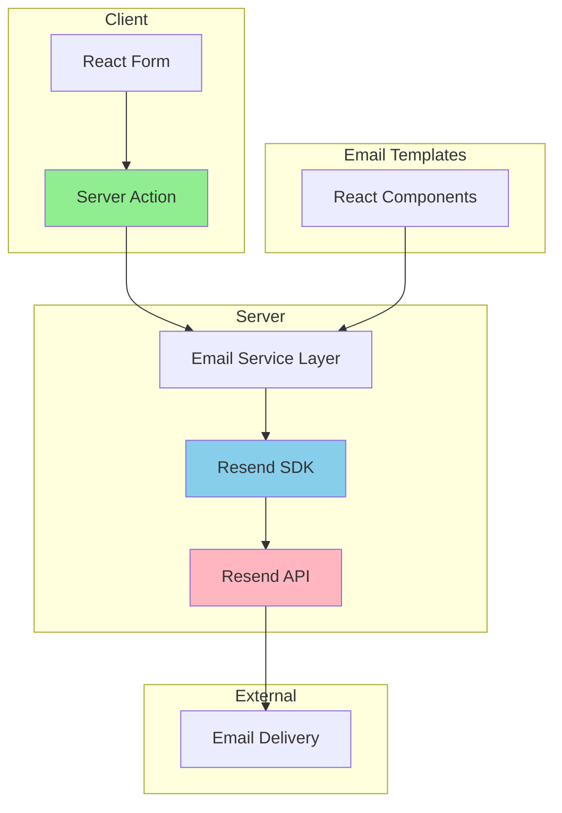
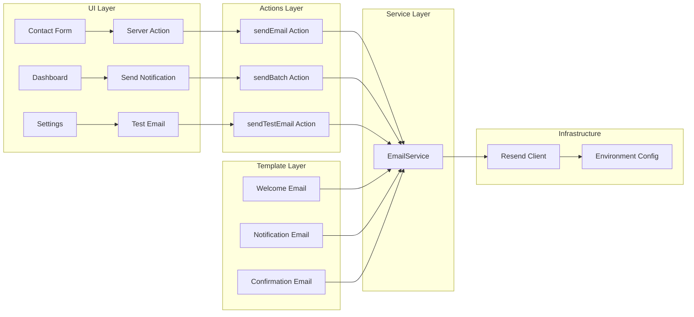
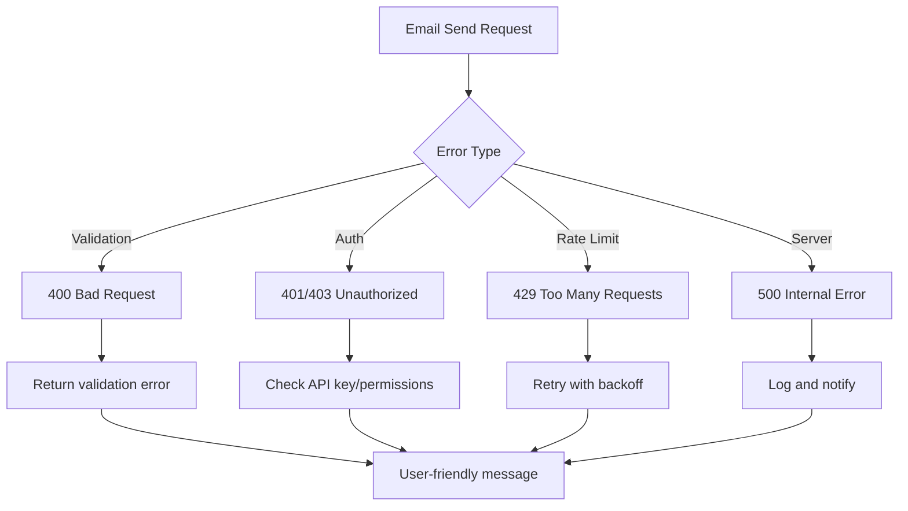

# Resend Email Integration - Architecture Design

## Executive Summary

This document outlines the architecture for integrating Resend email service into the Next.js 16 application. The recommended approach uses **Server Actions** with **React Email Templates**, providing optimal performance, type safety, and developer experience.

---

## Decision: Server Actions with Resend SDK

### Options Comparison

| Feature | API Routes | Server Actions ⭐ | Direct Fetch |
|---------|-----------|-------------------|--------------|
| Performance | Good (extra HTTP) | **Best** (no HTTP) | Good (no SDK) |
| Type Safety | Medium | **High** | Low |
| Next.js 16 Native | Yes | **Yes** | No |
| Form Integration | Manual | **Direct** | Manual |
| Error Handling | Manual | **Built-in** | Manual |
| Code Simplicity | Medium | **High** | Low |
| SDK Features | Full | **Full** | Limited |
| Learning Curve | Low | **Medium** | High |

### Selected Approach: Server Actions

**Reason:**
1. **Native Next.js 16 feature** - Built-in support, no extra dependencies
2. **Better performance** - No additional HTTP request overhead
3. **Type-safe** - Full TypeScript support with form validation
4. **Direct form integration** - Works seamlessly with React forms
5. **Progressive enhancement** - Works without JavaScript
6. **Automatic error handling** - Built-in error boundaries
7. **Developer experience** - Less boilerplate, cleaner code

**Impact on System:**
- Minimal impact on existing features
- No changes to client-side code required
- Server-side only implementation
- Can be adopted incrementally
- No breaking changes

---

## System Architecture

### High-Level Architecture



### Component Architecture



---

## File Structure

```
src/
├── actions/
│   └── email/
│       ├── send-email.ts          # Generic email sending
│       ├── send-batch.ts          # Batch email sending
│       ├── send-welcome.ts        # Welcome email action
│       ├── send-notification.ts   # Notification email action
│       └── send-confirmation.ts   # Confirmation email action
│
├── components/
│   └── email/
│       ├── welcome-email.tsx      # Welcome email template
│       ├── notification-email.tsx  # Notification email template
│       ├── confirmation-email.tsx # Confirmation email template
│       └── shared/
│           ├── email-layout.tsx   # Base email layout
│           └── email-footer.tsx   # Email footer component
│
├── lib/
│   ├── resend.ts                  # Resend client initialization
│   └── email/
│       ├── email-service.ts       # Email service layer
│       ├── email-validator.ts    # Email validation utilities
│       └── email-logger.ts       # Email logging utilities
│
└── types/
    └── email.ts                   # Email type definitions
```

---

## Component Details

### 1. Resend Client Initialization

**File:** `src/lib/resend.ts`

```typescript
import { Resend } from 'resend';

// Singleton pattern for Resend client
let resendInstance: Resend | null = null;

export function getResendClient(): Resend {
  if (!resendInstance) {
    if (!process.env.RESEND_API_KEY) {
      throw new Error('RESEND_API_KEY environment variable is not set');
    }
    resendInstance = new Resend(process.env.RESEND_API_KEY);
  }
  return resendInstance;
}

// Export for direct use
export const resend = getResendClient();
```

**Benefits:**
- Singleton pattern prevents multiple instances
- Centralized configuration
- Easy to mock for testing
- Environment variable validation

### 2. Email Service Layer

**File:** `src/lib/email/email-service.ts`

```typescript
import { resend } from '@/lib/resend';
import { EmailData, SendEmailResult } from '@/types/email';

export class EmailService {
  /**
   * Send a single email
   */
  async sendEmail(data: EmailData): Promise<SendEmailResult> {
    try {
      const { data: result, error } = await resend.emails.send(data);

      if (error) {
        return {
          success: false,
          error: error.message,
          statusCode: error.statusCode,
        };
      }

      return {
        success: true,
        data: result,
      };
    } catch (error) {
      return {
        success: false,
        error: error instanceof Error ? error.message : 'Unknown error',
        statusCode: 500,
      };
    }
  }

  /**
   * Send multiple emails in batch
   */
  async sendBatch(emails: EmailData[]): Promise<SendEmailResult> {
    try {
      const { data, error } = await resend.batch.send(emails);

      if (error) {
        return {
          success: false,
          error: error.message,
          statusCode: error.statusCode,
        };
      }

      return {
        success: true,
        data,
      };
    } catch (error) {
      return {
        success: false,
        error: error instanceof Error ? error.message : 'Unknown error',
        statusCode: 500,
      };
    }
  }

  /**
   * Send email with retry logic for rate limits
   */
  async sendWithRetry(
    data: EmailData,
    maxRetries: number = 3
  ): Promise<SendEmailResult> {
    for (let attempt = 0; attempt < maxRetries; attempt++) {
      const result = await this.sendEmail(data);

      if (result.success) {
        return result;
      }

      // Retry on rate limit (429)
      if (result.statusCode === 429 && attempt < maxRetries - 1) {
        const delay = Math.pow(2, attempt) * 1000; // Exponential backoff
        await new Promise(resolve => setTimeout(resolve, delay));
        continue;
      }

      return result;
    }

    return {
      success: false,
      error: 'Max retries exceeded',
      statusCode: 500,
    };
  }
}

// Export singleton instance
export const emailService = new EmailService();
```

**Benefits:**
- Centralized email logic
- Retry logic built-in
- Consistent error handling
- Easy to extend
- Testable

### 3. Server Actions

**File:** `src/actions/email/send-email.ts`

```typescript
"use server";

import { emailService } from '@/lib/email/email-service';
import { z } from 'zod';
import { EmailData } from '@/types/email';

// Validation schema
const SendEmailSchema = z.object({
  to: z.array(z.string().email()),
  subject: z.string().min(1).max(255),
  html: z.string().optional(),
  text: z.string().optional(),
  react: z.any().optional(),
});

export async function sendEmail(formData: FormData) {
  // Validate input
  const validation = SendEmailSchema.safeParse({
    to: formData.getAll('to'),
    subject: formData.get('subject'),
    html: formData.get('html'),
    text: formData.get('text'),
  });

  if (!validation.success) {
    return {
      success: false,
      error: 'Validation failed',
      details: validation.error.errors,
    };
  }

  // Prepare email data
  const emailData: EmailData = {
    from: process.env.RESEND_FROM_EMAIL || 'noreply@yourdomain.com',
    to: validation.data.to,
    subject: validation.data.subject,
    html: validation.data.html,
    text: validation.data.text,
  };

  // Send email
  const result = await emailService.sendWithRetry(emailData);

  return result;
}
```

**Benefits:**
- Form validation with Zod
- Type-safe
- Direct form integration
- Automatic error handling
- Server-side execution

### 4. Email Templates

**File:** `src/components/email/welcome-email.tsx`

```typescript
import * as React from 'react';
import { EmailLayout } from './shared/email-layout';
import { EmailFooter } from './shared/email-footer';

interface WelcomeEmailProps {
  firstName: string;
  companyName?: string;
  loginUrl?: string;
}

export function WelcomeEmail({
  firstName,
  companyName = 'Your Company',
  loginUrl = 'https://yourdomain.com/login',
}: WelcomeEmailProps) {
  return (
    <EmailLayout>
      <div style={{ fontFamily: 'Arial, sans-serif', maxWidth: '600px', margin: '0 auto' }}>
        <h1 style={{ color: '#333', fontSize: '24px', marginBottom: '20px' }}>
          Welcome to {companyName}!
        </h1>
        
        <p style={{ color: '#666', fontSize: '16px', lineHeight: '1.6' }}>
          Hi {firstName},
        </p>
        
        <p style={{ color: '#666', fontSize: '16px', lineHeight: '1.6' }}>
          We're excited to have you on board! Your account has been successfully created.
        </p>
        
        <div style={{ textAlign: 'center', margin: '30px 0' }}>
          <a
            href={loginUrl}
            style={{
              backgroundColor: '#007bff',
              color: '#fff',
              padding: '12px 24px',
              textDecoration: 'none',
              borderRadius: '4px',
              fontSize: '16px',
              display: 'inline-block',
            }}
          >
            Get Started
          </a>
        </div>
        
        <p style={{ color: '#666', fontSize: '16px', lineHeight: '1.6' }}>
          If you have any questions, feel free to reach out to our support team.
        </p>
        
        <EmailFooter />
      </div>
    </EmailLayout>
  );
}
```

**Benefits:**
- Type-safe props
- Reusable components
- Easy to maintain
- Dynamic content
- Professional design

### 5. Type Definitions

**File:** `src/types/email.ts`

```typescript
import { ReactElement } from 'react';

export interface EmailData {
  from: string;
  to: string | string[];
  subject: string;
  html?: string;
  text?: string;
  react?: ReactElement;
  cc?: string | string[];
  bcc?: string | string[];
  replyTo?: string;
  attachments?: Array<{
    filename: string;
    content?: string | Buffer;
    path?: string;
  }>;
  tags?: Array<{
    name: string;
    value: string;
  }>;
}

export interface SendEmailResult {
  success: boolean;
  data?: any;
  error?: string;
  statusCode?: number;
  details?: any;
}

export interface EmailTemplateProps {
  [key: string]: any;
}
```

**Benefits:**
- Type safety
- IntelliSense support
- Documentation
- Prevents errors

---

## Environment Configuration

### Required Environment Variables

```bash
# .env.local
RESEND_API_KEY=re_xxxxxxxxxxxxxxxxxxxxxx
RESEND_FROM_EMAIL=noreply@yourdomain.com
RESEND_FROM_NAME=Your Company

# Optional
RESEND_WEBHOOK_SECRET=wh_xxxxxxxxxxxxxxxxxxxxxx
```

### Environment Variable Validation

**File:** `src/lib/email/email-validator.ts`

```typescript
export function validateEmailConfig() {
  const required = ['RESEND_API_KEY', 'RESEND_FROM_EMAIL'];
  const missing = required.filter(key => !process.env[key]);

  if (missing.length > 0) {
    throw new Error(
      `Missing required environment variables: ${missing.join(', ')}`
    );
  }

  // Validate email format
  const emailRegex = /^[^\s@]+@[^\s@]+\.[^\s@]+$/;
  if (!emailRegex.test(process.env.RESEND_FROM_EMAIL!)) {
    throw new Error('Invalid RESEND_FROM_EMAIL format');
  }

  return true;
}
```

---

## Error Handling Strategy

### Error Classification



### Error Handling Implementation

```typescript
export function handleEmailError(error: any): SendEmailResult {
  // Rate limit errors
  if (error.statusCode === 429) {
    return {
      success: false,
      error: 'Too many requests. Please try again later.',
      statusCode: 429,
    };
  }

  // Authentication errors
  if (error.statusCode === 401 || error.statusCode === 403) {
    return {
      success: false,
      error: 'Authentication failed. Please check your API key.',
      statusCode: error.statusCode,
    };
  }

  // Validation errors
  if (error.statusCode === 400 || error.statusCode === 422) {
    return {
      success: false,
      error: 'Invalid email data. Please check your input.',
      statusCode: error.statusCode,
      details: error.message,
    };
  }

  // Server errors
  if (error.statusCode >= 500) {
    return {
      success: false,
      error: 'Server error. Please try again later.',
      statusCode: error.statusCode,
    };
  }

  // Unknown errors
  return {
    success: false,
    error: 'An unexpected error occurred.',
    statusCode: 500,
  };
}
```

---

## Security Considerations

### 1. API Key Management
- ✅ Store in environment variables
- ✅ Never commit to version control
- ✅ Use different keys for dev/prod
- ✅ Rotate keys regularly
- ✅ Delete unused keys

### 2. Input Validation
- ✅ Validate all email addresses
- ✅ Sanitize HTML content
- ✅ Limit attachment sizes
- ✅ Validate file types

### 3. Rate Limiting
- ✅ Implement exponential backoff
- ✅ Monitor usage
- ✅ Queue emails if needed
- ✅ Request limit increase if needed

### 4. Domain Verification
- ✅ Verify domain before production
- ✅ Use verified domain in `from` field
- ✅ Configure DKIM/SPF records
- ✅ Test with test domain first

### 5. Webhook Security
- ✅ Verify webhook signatures
- ✅ Use HTTPS only
- ✅ Implement replay protection
- ✅ Log all webhook events

---

## Testing Strategy

### Unit Tests
```typescript
// Test email service
describe('EmailService', () => {
  it('should send email successfully', async () => {
    const result = await emailService.sendEmail(mockEmailData);
    expect(result.success).toBe(true);
  });

  it('should handle rate limits with retry', async () => {
    const result = await emailService.sendWithRetry(mockEmailData);
    expect(result.success).toBe(true);
  });
});
```

### Integration Tests
```typescript
// Test server actions
describe('sendEmail action', () => {
  it('should validate input', async () => {
    const formData = new FormData();
    formData.append('to', 'invalid-email');
    const result = await sendEmail(formData);
    expect(result.success).toBe(false);
  });
});
```

### E2E Tests
```typescript
// Test email delivery
describe('Email Delivery', () => {
  it('should send welcome email after signup', async () => {
    await signup(mockUserData);
    // Check email was sent via Resend dashboard or test inbox
  });
});
```

---

## Monitoring & Logging

### Email Logging

**File:** `src/lib/email/email-logger.ts`

```typescript
export function logEmailEvent(event: {
  type: 'sent' | 'failed' | 'retry';
  emailData: EmailData;
  result?: SendEmailResult;
  metadata?: any;
}) {
  console.log(`[Email ${event.type.toUpperCase()}]`, {
    to: event.emailData.to,
    subject: event.emailData.subject,
    result: event.result,
    timestamp: new Date().toISOString(),
    ...event.metadata,
  });
}
```

### Metrics to Track
- Email send rate
- Success/failure rate
- Rate limit hits
- Average delivery time
- Template usage
- Error types

---

## Performance Optimization

### 1. Batch Sending
- Send multiple emails in one request
- Reduce API calls
- Better for notifications

### 2. Caching
- Cache email templates
- Cache validation results
- Reduce redundant processing

### 3. Queue System
- Implement job queue for bulk emails
- Process in background
- Prevent timeout issues

### 4. CDN for Attachments
- Host large attachments on CDN
- Use URLs instead of base64
- Reduce payload size

---

## Deployment Checklist

### Development
- [ ] Install Resend SDK
- [ ] Set up environment variables
- [ ] Create test domain
- [ ] Implement email templates
- [ ] Test email sending locally
- [ ] Verify error handling

### Production
- [ ] Verify production domain
- [ ] Configure DKIM/SPF records
- [ ] Set up monitoring
- [ ] Configure webhooks
- [ ] Test with production API key
- [ ] Set up alerts for failures
- [ ] Document email flows

---

## Migration Path

### Phase 1: Setup (Week 1)
1. Install Resend SDK
2. Configure environment variables
3. Create email service layer
4. Implement basic email templates

### Phase 2: Integration (Week 2)
1. Create Server Actions
2. Integrate with existing forms
3. Add error handling
4. Implement logging

### Phase 3: Testing (Week 3)
1. Unit tests
2. Integration tests
3. E2E tests
4. Load testing

### Phase 4: Launch (Week 4)
1. Deploy to staging
2. Test with real emails
3. Monitor metrics
4. Deploy to production

---

## Impact Analysis

### What Will Change
- New email service layer
- New Server Actions
- New email templates
- Environment variables

### What Will NOT Change
- Existing UI components
- Existing database schema
- Existing authentication
- Existing API routes

### Potential Conflicts
- None identified
- Can coexist with existing email solutions
- No breaking changes

### Feature Creep Risks
- Adding too many templates at once
- Over-engineering the service layer
- Adding unnecessary features

**Mitigation:**
- Start with essential templates only
- Keep service layer simple
- Focus on core functionality

---

## Next Steps

1. ✅ Review architecture document
2. ✅ Approve implementation plan
3. ⏳ Switch to Code mode for implementation
4. ⏳ Follow implementation phases
5. ⏳ Test thoroughly
6. ⏳ Deploy to production

---

## References

- [Resend Documentation](https://resend.com/docs)
- [Next.js Server Actions](https://nextjs.org/docs/app/building-your-application/data-fetching/server-actions)
- [React Email](https://react.email/)
- [Zod Validation](https://zod.dev/)
